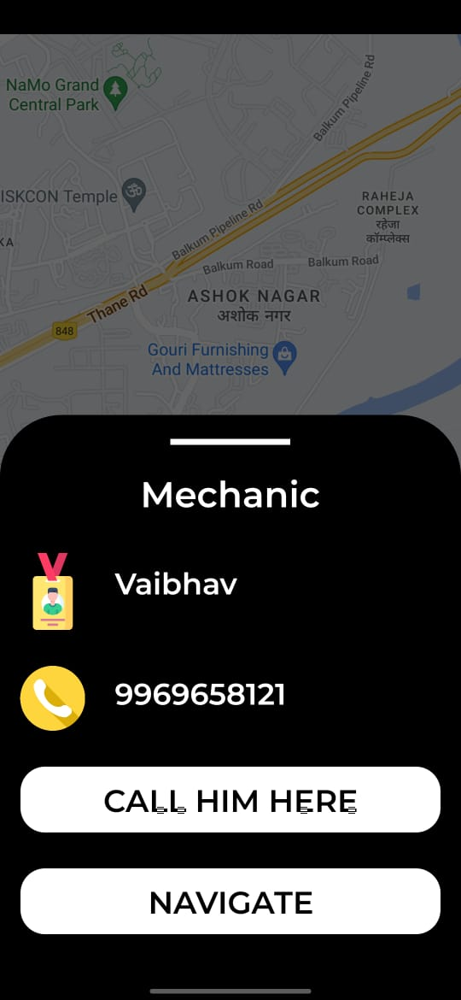

# **Car-Breakdown-Assistance** 🚗🔧  
An aesthetically pleasing Android application designed to assist users with vehicle breakdowns. Using **Google Maps API**, the app helps locate nearby mechanics, allowing users to navigate or call them directly. It’s a seamless experience for both users and mechanics with Firebase-powered authentication and real-time data storage.

## **Key Features** 🌟  
### **For Users**:  
- **Login/Signup**: Powered by **Firebase Authentication** for secure user access.  
- **Profile Management**:  
  - View and edit profile details.  
  - Customize the app's aesthetic theme.  
- **Contact Us**:  
  - **Call Us**: Automatically opens the phone dialer with the number pre-filled.  
  - **Mail Us**: Launches the email client with the recipient address pre-filled.  
- **Find Mechanics**:  
  - Integrated **Google Maps API** to locate nearby mechanics based on the user's current location.  
  - **Marker Info**: View mechanic details (name, contact) in a **bottom sheet**.  
  - **Actions**:  
    - **Call Mechanic**: Quickly dial their number.  
    - **Navigate to Mechanic**: Opens Google Maps for turn-by-turn navigation.
### **For Mechanics**:  
- **Mechanic Login**: Dedicated login for mechanics to manage their presence.  
- **Add Location**: Save the mechanic's location (latitude and longitude) to the Firebase database, making it visible to users.  
- **Contact Us**: Same functionality as the user side, with quick access to call or email.  

---

## **Tech Stack** ⚙️  
- **Programming Language**: Java  
- **Database**: Firebase Realtime Database  
- **Authentication**: Firebase Authentication  
- **Maps Integration**: Google Maps API  
- **UI**: Material Design with customizable themes for a sleek and aesthetic look  

---

## **App Flow** 🛠️  
### **User Side**:  
1. **Login/Signup**: Authenticate via Firebase.  
2. **Homepage**: Access:  
   - Profile  
   - Contact Us  
   - **Find Mechanic Button**: Opens the map view to locate nearby mechanics.  
3. **Map View**:  
   - Displays the user’s location and nearby mechanics as markers.  
   - Clicking a marker opens a **bottom sheet** with:  
     - Mechanic's name and contact number.  
     - Buttons to **call** or **navigate** to the mechanic.  
4. **Profile Page**: View, edit, and customize app appearance.  

### **Mechanic Side**:  
1. **Login**: Mechanic login page with Firebase Authentication.  
2. **Homepage**:  
   - **Add Location**: Mechanic can add their coordinates, which updates the Firebase database.  
   - **Contact Us**: Access the call and mail options.  

---
## 📱 Screenshots  

### Mechanic Homepage Page:  
 

### Contact Us Page:  
 

### User's Homepage:  
 

### Login Page:  
 

### Admin Dashboard:  
  

###  Mechanic Marker BottomSheet:  
  

### Mechanic save location page:  
  

### User's Find Mechanic Page:  
    

---

## **How to Install and Run the App** 💻  
1. Clone the repository:  
   ```bash  
   git clone https://github.com/your-username/Car-Breakdown-Assistance.git  
2. Open the project in Android Studio.
3. Add your Firebase configuration files (google-services.json).
4. Generate an API key for Google Maps API and include it in your AndroidManifest.xml:
5. Build and run the project on your emulator or Android device.

---
### **Install the App**  
Alternatively, you can directly install the prebuilt APK available in the repository under the `releases` folder.

---

## **Highlight** 🚀  
- **Seamless Assistance**: Simplifies finding mechanics for vehicle breakdowns.  
- **Dual Functionality**: Tailored experiences for both users and mechanics.  
- **Real-Time Data**: Firebase ensures accurate and up-to-date information.  
- **Aesthetic Design**: Intuitive, modern, and visually appealing user interface.  

---

### **What Changed**  
- **How to Install and Run the App**: Now mentions a prebuilt APK in the repo for easy installation.  
- Added clear sections for readability and a callout to replace with screenshots.  

---

Just replace `YOUR_GOOGLE_MAPS_API_KEY` with your actual API key and add the appropriate screenshots when ready. You can also update the GitHub URL to reflect your actual repository.
